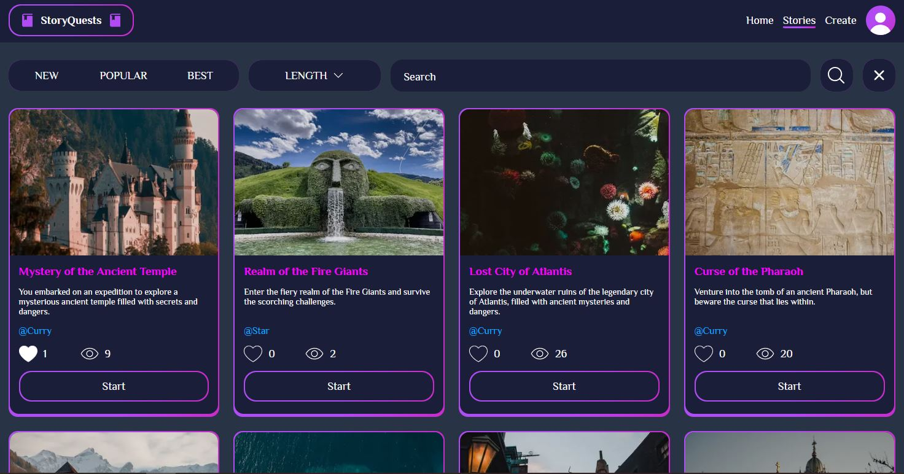

### StoryQuests - сайт с текстовыми квестами

Сайт с возможностью проходить текстовые квесты и создавать свои.

Функционал:
+ Поиск и фильтрация квестов с пагинацией
+ Упрощённая авторизация на JWT
+ Прохождение тестов
+ Создание квестов при помощи редактирования диаграммы сцен
+ Добавение картинок ссылками из ресурсов, адрес которых начинается с `https://`
+ Лайки квестов
+ Просмотр результата последнего прохождения и статистики


<picture>
 
</picture>

Backend (Golang): https://github.com/IvanZemsky/StoryQuests-Backend

### Стек технологий:
+ React 19
+ Next 15
+ CSS modules
+ React Query
+ Axios
+ React Flow
+ React Hook Form
+ React Transition Group
+ Zod

**Моки**:
+ Mock Service Worker
+ OpenAPI Fetch
+ OpenAPI MSW
+ Jose

### Установка и запуск:

Версия Node.js: 22.17.0 и выше

1. Установите и запустите проект API по инструкции: https://github.com/IvanZemsky/StoryQuests-Backend

2. Склонируйте репозиторий:
```git clone https://github.com/IvanZemsky/StoryQuests-Frontend [директория]```
3. Выполните установку пакетов:
```npm install ```

4. Создайте файл ```.end.local```:

    ```
    NEXT_PUBLIC_API_URL=http://localhost:8080
    NEXT_PUBLIC_ENABLE_MOCKS=false # разрешены ли моки
    ```

5. Запустите проект: ```npm run dev```

Сайт будет доступен по адресу: http://localhost:3000
